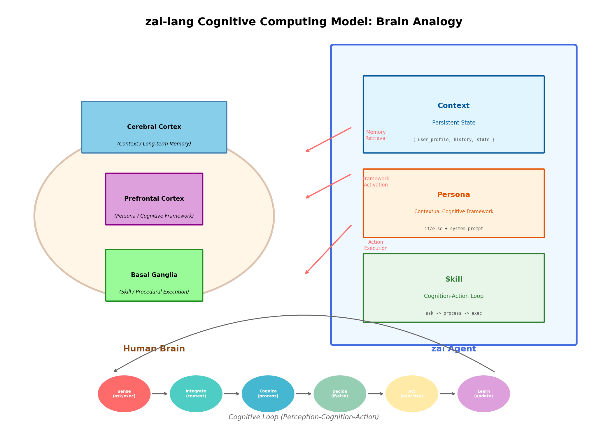
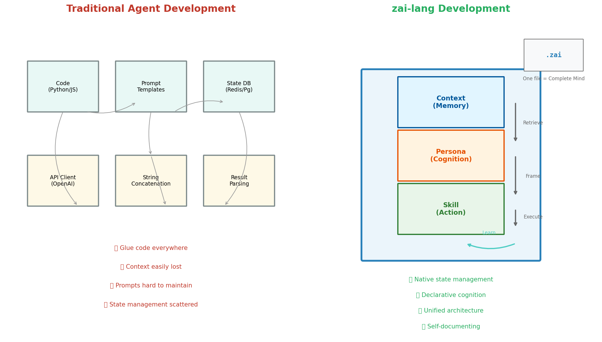

# zai 语言哲学：认知计算模型

zai-lang 的设计哲学源于对人脑认知过程的模拟。我们相信，AI Agent 的构建应该像人类思考一样自然。

---

## 核心概念的人脑类比

### Context（上下文）= 长期记忆

**人脑中的对应物**：大脑皮层中的长期记忆存储

就像人类大脑存储着过去的经历、知识和当前对世界的感知，zai 的 `context` 是 Agent 的**持久化记忆场**。它不是在函数间传递的参数，而是始终存在的认知背景。

```zai
context Memory {
    user_preferences: ""           // 用户偏好记忆
    conversation_history: []       // 对话历史记忆
    current_task_state: ""         // 当前任务状态
    learned_knowledge: ""          // 学习获得的知识
}
```

**关键洞察**：
- 人类不会每次对话都重新介绍自己，context 也是如此
- 人类根据记忆调整行为，Agent 根据 context 调整响应
- 人类的记忆会不断累积，context 也在会话中持续演化

---

### Persona（人格）= 认知框架与决策倾向

**人脑中的对应物**：前额叶皮层的执行功能 + 情境感知调节

人类在不同情境下会激活不同的认知框架：
- 面对紧急危险时，"战斗或逃跑"模式启动
- 面对朋友时，社交亲和模式启动
- 面对工作问题时，分析模式启动

`persona` 就是这种**情境化的认知框架**，它决定了 AI 如何"思考"和"决策"。

```zai
persona CrisisHandler {
    // 紧急情境下的认知框架
    if (context.severity == "critical") {
        system: "你处于危机处理模式：
                 1. 优先止损，快速响应
                 2. 只关注最关键的信息
                 3. 给出明确、可执行的指令"
    }

    // 日常情境下的认知框架
    else {
        system: "你处于分析模式：
                 1. 全面考虑各种因素
                 2. 提供详细的解释
                 3. 探讨多种解决方案"
    }
}
```

**关键洞察**：
- 同一个人在不同情境下表现不同，同一个 persona 可根据 context 动态调整
- persona 不是固定的"人设"，而是**情境敏感的认知策略**
- 它像人类的社会角色一样，决定了"在什么情况下如何思考"

---

### Skill（技能）= 完整的任务执行流程

**人脑中的对应物**：基底神经节的程序化记忆 + 前额叶的实时调度

人类执行复杂任务时：
1. 回忆相关知识（读取 context）
2. 激活适合当前情境的思维模式（应用 persona）
3. 与环境交互（感知/行动循环）
4. 根据反馈调整（状态更新）

`skill` 就是这样一条**完整的认知-行动流水线**。

```zai
skill HandleEmergency() {
    // 1. 感知：获取当前状况（读取 context）
    say "当前状况: {{current_situation}}"

    // 2. 思考：AI 分析（激活 persona 的认知框架）
    process CrisisHandler.system {
        extract: ["risk_level", "recommended_action"]
    }

    // 3. 行动：执行决策
    if (context.risk_level == "high") {
        exec "trigger_evacuation_protocol()"
    }

    // 4. 学习：更新记忆
    context.action_history = "Executed {{recommended_action}} at {{timestamp}}"
}
```

**关键洞察**：
- skill 不是简单的"函数"，而是**有记忆、有性格、能学习的完整智能体**
- 就像人类专家执行任务时，会结合经验（context）和专业直觉（persona）
- 每次执行都是对 agent "经验"的丰富

---

### Agent System Prompt（基础身份）= 核心自我认知

**人脑中的对应物**：大脑皮层中的自我表征 + 杏仁核的情绪基调

人类的自我认知是相对稳定的：无论面对什么情境，你都知道自己是谁，有自己的核心价值观和行为底线。Agent System Prompt 就是这种**基础自我认知**。

```zai
agent CustomerServiceBot
<<<
You are a professional customer service representative.
Core values: Empathy, Efficiency, Integrity
Current customer: {{customer_name}}
>>>
```

**与 Persona 的区别**：
- **Agent System Prompt**：基础身份（稳定，定义"你是谁"）
- **Persona**：情境适应（动态，定义"在这个场景下如何表现"）

就像一位医生，基础身份是"救死扶伤的医务工作者"（Agent System Prompt），但面对急诊病人时会激活"紧急抢救模式"，面对门诊病人时激活"诊断咨询模式"（Persona）。

---

## 执行模型：认知循环



*图1：zai-lang 认知架构与人脑类比*

上图展示了 zai-lang 的核心设计哲学：
- **左侧人脑**：大脑皮层（长期记忆）→ 前额叶（认知框架）→ 基底神经节（程序执行）
- **右侧 zai Agent**：Context → Persona → Skill 的完美映射
- **底部循环**：感知-整合-认知-决策-行动-学习的完整认知闭环

```
┌─────────────────────────────────────────────────────────────┐
│                      认知循环 (Cognitive Loop)               │
│                                                             │
│   ┌──────────┐      ┌──────────┐      ┌──────────┐         │
│   │  Memory  │─────▶│  Persona │─────▶│  Action  │         │
│   │(Context) │      │(Cognitive │      │ (Skill)  │         │
│   │          │      │ Framework│      │          │         │
│   └──────────┘      └──────────┘      └─────┬────┘         │
│         ▲                                   │               │
│         │                                   ▼               │
│         │                            ┌──────────┐          │
│         │                            │ External │          │
│         │                            │ World    │          │
│         │                            │          │          │
│         └────────────────────────────│ AI/Human/│          │
│                                      │ Systems  │          │
│                                      └──────────┘          │
└─────────────────────────────────────────────────────────────┘
```

**循环过程**：

1. **感知阶段**（Sense）：从外部世界获取信息（`ask`, `exec` 结果）
2. **整合阶段**（Integrate）：更新记忆（`context.xxx = value`）
3. **认知阶段**（Cognize）：基于记忆和人格框架进行推理（`process`）
4. **决策阶段**（Decide）：根据推理结果决定行动（`if/while` 逻辑）
5. **执行阶段**（Act）：影响外部世界（`exec`, `say`, `notify`）
6. **学习阶段**（Learn）：将结果反馈到记忆中（context 更新）

这与人类认知科学的[感知-认知-行动循环](https://en.wikipedia.org/wiki/Perception%E2%80%93cognition%E2%80%93action_loop)高度一致。

---

## 与传统 Agent 开发的对比



*图2：传统开发 vs zai-lang 开发范式对比*

### 传统开发模式

```python
# 传统方式：代码 + 提示词分离
import openai

def handle_user_request(user_input, history, user_profile, settings):
    # 1. 手动构建提示词（每次都要重新组装）
    prompt = f"""
    你是一个助手。
    用户历史: {history}
    用户画像: {user_profile}
    设置: {settings}

    用户说: {user_input}
    请回复：
    """

    # 2. 调用 LLM
    response = openai.chat.completions.create(
        model="gpt-4",
        messages=[{"role": "user", "content": prompt}]
    )

    # 3. 手动解析结果
    reply = response.choices[0].message.content

    # 4. 手动更新状态
    history.append({"user": user_input, "assistant": reply})
    save_to_database(history)

    return reply
```

**问题**：
- ❌ 状态管理是"外挂"的，容易丢失上下文
- ❌ 提示词是字符串拼接，难以维护和版本控制
- ❌ 认知框架（system prompt）是硬编码的，无法情境化
- ❌ 每次调用都要重新传递全部上下文

---

### zai-lang 模式

```zai
agent Assistant

// 1. 显式声明持久化记忆
context Memory {
    history: []
    user_profile: {}
    preferences: {}
}

// 2. 显式声明认知框架
persona AdaptivePersona {
    if (context.user_emotion == "frustrated") {
        system: "你是耐心的客服，优先安抚情绪"
    } else {
        system: "你是高效的问题解决者"
    }
}

// 3. 完整的认知-行动循环
skill HandleRequest(user_input) {
    // 感知：理解用户输入
    context.current_input = user_input

    // 认知：AI 分析（自动携带完整 context 和 persona）
    process AdaptivePersona.system {
        extract: ["intent", "emotion", "response"]
    }

    // 学习：自动更新记忆
    context.history = context.history + [{
        input: user_input,
        output: context.response,
        emotion: context.emotion
    }]

    // 行动：输出回复
    say context.response
}
```

**优势**：
- ✅ **状态是原生的**：context 是语言级特性，自动持久化
- ✅ **认知是可配置的**：persona 像 CSS 一样，声明式定义行为模式
- ✅ **上下文自动传递**：process 自动携带完整 context，无需手动拼接
- ✅ **代码即文档**：.zai 文件就是 Agent 的完整定义

---

## 关键优势总结

| 维度 | 传统开发 | zai-lang |
|------|---------|----------|
| **状态管理** | 外挂数据库/变量，手动传递 | 原生 context，自动持久化 |
| **提示词工程** | 字符串拼接，难以维护 | 声明式 persona，版本可控 |
| **认知框架** | 硬编码 system prompt | 动态 persona，情境感知 |
| **上下文传递** | 每次调用手动组装 | 自动注入，完整状态 |
| **人机协作** | 需要额外开发交互逻辑 | 原生 `ask`/`say` 原语 |
| **工具集成** | 需要编写调用代码 | 原生 `exec` 原语 |
| **可解释性** | 分散在代码各处 | 单一 .zai 文件，自描述 |
| **可演进性** | 修改代码风险高 | 修改 persona/context 即可调整行为 |

---

## 思维方式的转变

### 从"调用 API" 到"设计认知"

传统开发关注"如何调用 LLM API"，zai-lang 关注"如何设计 Agent 的认知架构"。

就像：
- 传统方式像手动操作机器（关注按钮和杠杆）
- zai-lang 像训练一位员工（关注他的知识和性格）

### 从"写代码" 到"定义心智"

在 zai-lang 中，你不再只是"写程序"，而是在**定义一个数字生命的心智结构**：
- 它的记忆（context）
- 它的性格（persona）
- 它的能力（skill）

这与[心智社会](https://en.wikipedia.org/wiki/Society_of_Mind)（Society of Mind）理论相契合：智能 emerges 自简单的 Agent 之间的交互。

---

## 结语

zai-lang 不是又一个 LLM 包装器，而是一种**认知计算范式**。它让开发者从"胶水代码"中解放出来，专注于真正重要的事情：

> **设计能够理解、记忆、学习和行动的 AI 心智。**
